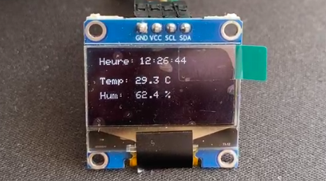

# Réveil Connecté
📄 Ce projet est réalisé dans le cadre du module Communication Sans Fil en Licence 1 à l’Université
Nice Sophia Antipolis

Un réveil qui affiche l’heure, la température, l’humidité et la luminosité.

## 🛠️ Matériel utilisé
- UCA board version 2021
- Capteurs : température/humidité (DHT22)
- Écran OLED
- Câbles
- Buzzer

## 📦 Organisation du dépôt

- `arduino/` : Code microcontrôleur
- `web/` : fichiers du site web embarqué
- `docs/` : vidéo, images et présentation

## ⚡Fonctionnalités
- Affichage de l’heure en temps réel
- Mesure température et humidité

## ✨Aperçu

